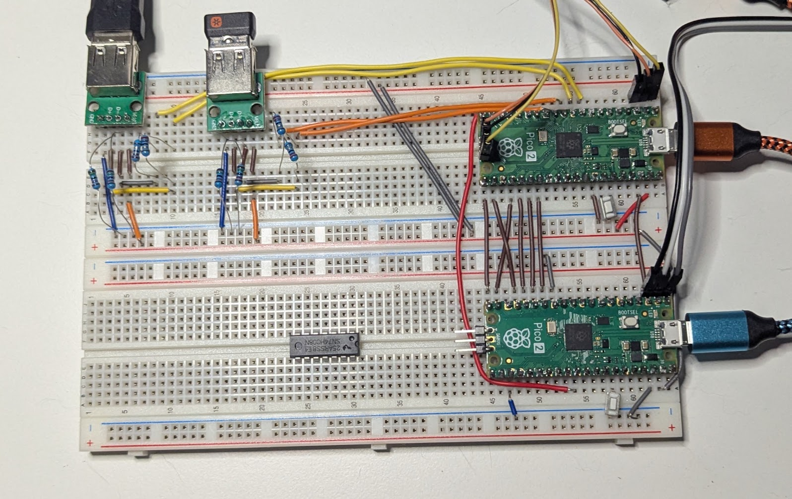
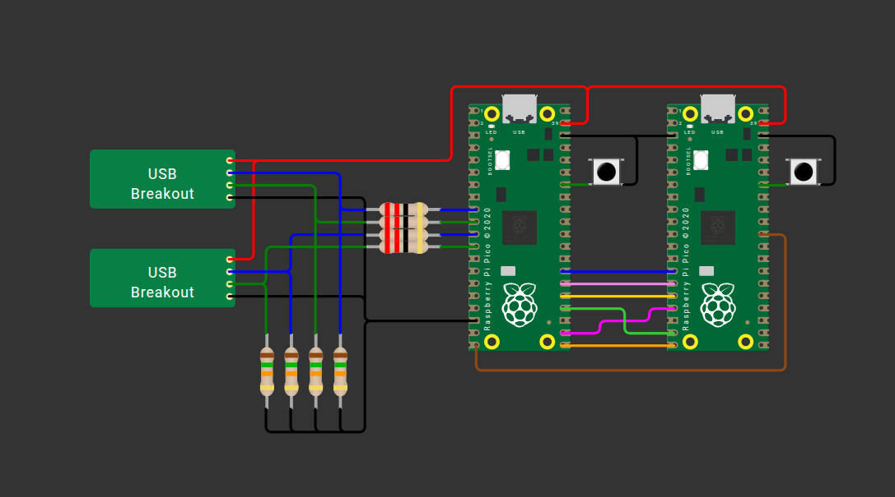
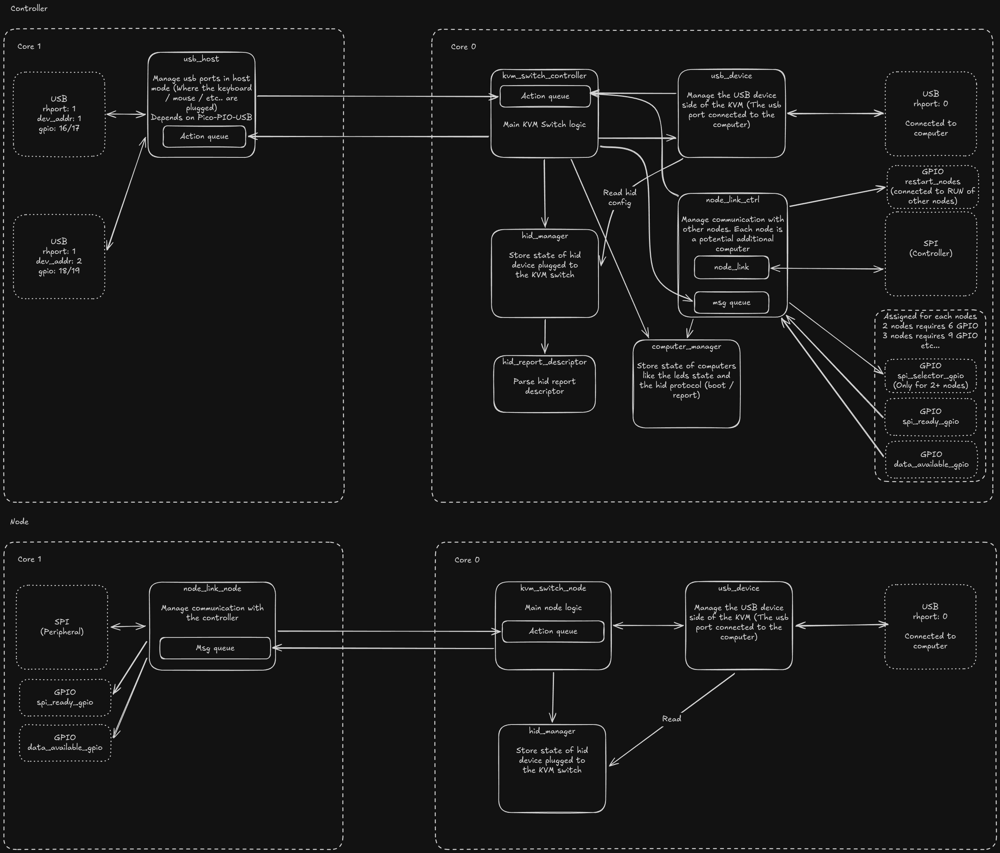

# KVM Switch

A KVM Switch for any HID device built with multiple [Raspberry Pi Pico 2](https://www.raspberrypi.com/products/raspberry-pi-pico-2/)

## Status

This project is still in development.

So far I can use it as a KVM switch. I can select the computer to use with a keyboard shortcut. I was not able to
test with exotic keyboard / mouse yet, but those should be supported.

The remaining tasks are:
- Test with 2 nodes (switch between 3 computers).
- Design PCB for 1 node (and maybe for 2 nodes later)
- Write documentation
- Add a way to configure the switch (I need to explore WebUSB)
- Be able to switch only the keyboard or the mouse
- Test `TUD_OPT_HIGH_SPEED`

## AI Usage

Basically, I see AI as a tool, and I have fun writing code, so:

- All the code in `src/` is written by a human.
- AI was used as a learning assistant, to help understand and learn all the USB / HID / Electronic stuff.
- AI was used to review the code.
- AI was used to generate some test cases (but the test logic is human-made) (see `AI-generated` comments).
- AI was used to generate tool to debug / understand (like `tools/hid_report_descriptor_parser`).

## History

This project started to fix an issue I had with my current commercial KVM switch, that is the delay to switch between
2 computers; I wanted a shortcut to switch instantaneously. This project is also an opportunity for me to learn a some
few things with electronic and discover dev on a microcontroller. Feel free to provide any feedback, as I'm still
learning.

I first tried to use CH9329 and CH9350 to avoid skipping all the USB parts and get this done quickly. However, during 
my testing I discovered that the CH9329 has a HID descriptor that does not expose all the features I wanted (like the 
mouse pan) and the CH9350 felt the same way. So I learnt a lot about HID descriptors, tinyUSB, etc… And, now this project
should support any HID device (not just keyboard and mouse) like Gamepad etc… I kept the code I used to use those chip
in `src/legacy` if anyone need this, feel free to use it 

## Hardware Architecture

You can also see this on Wokwi to get the name of the pins

https://wokwi.com/projects/474027085801457665

## Software Architecture

